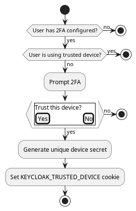
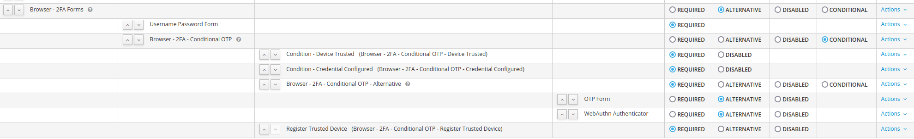
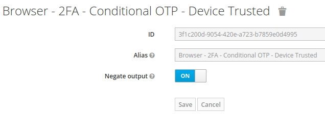
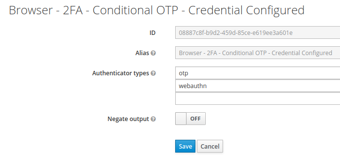
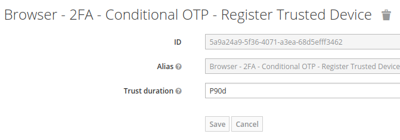
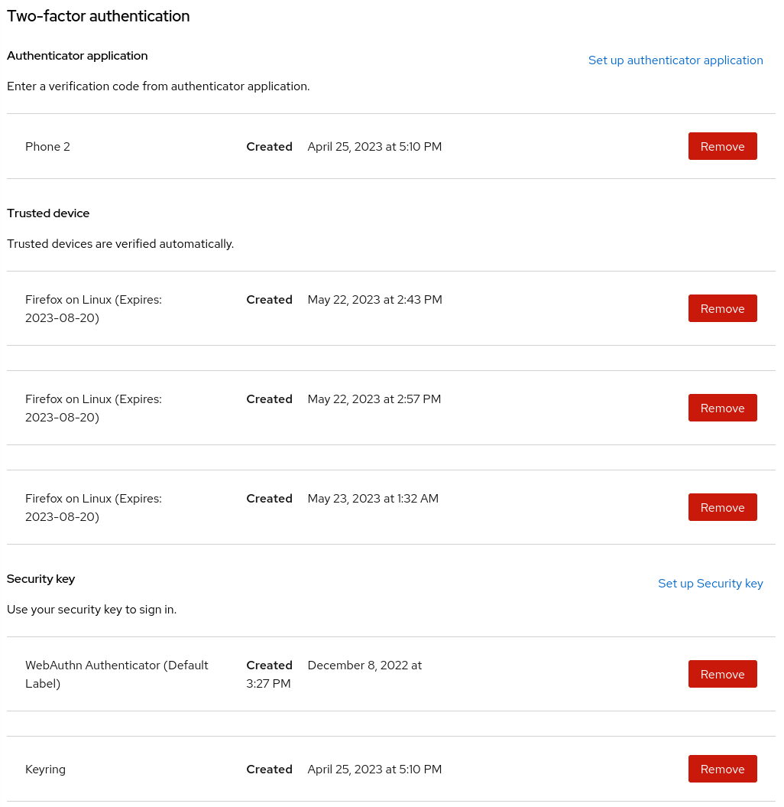

# README

This repository contains the keycloak-spi-trusted-device Keycloak plugin.

The goal of this plugin is to enable users who log in using multi-factor authentication to trust
their device, so they do not have to provide a second factor when using that device.

The feature is mentioned as a native capability in Keycloak [here](https://github.com/keycloak/keycloak/issues/8742),
but it has not been implemented yet, and it's uncertain if it ever will be.
Therefore, we are currently implementing it as an extension.

The functionality is illustrated in the following diagram. Details about the individual components are provided below.



## Usage

This plugin provides several components:

* **Trusted device credential**: Each trusted device is registered as a Keycloak credential, which
  can be managed by users or administrators on the account page.
* **Register Trusted Device**: Prompts a user if they want to trust the device they are logging in
  on
* **Condition - Device Trusted**: Matches if the user is logging in on a trusted device
* **Condition - Credential Configured**: Matches if the user has any of the specified credentials
  configured. This can be used instead of the default **Condition - user configured** which would
  also match the **Register Trusted Device** authenticator

To allow a user to login with either an OTP, webauthn or a trusted device this could be configured
as such:






Following the above example the user would be prompted for a second factor every 90 days on each
device.

During login the user will be prompted if they want to trust the device:


They can then manage their trusted devices on the account console:



## Development

To set up a local environment, first build the extension using Maven. Then, build a Docker image and start the Docker Compose stack.

```bash
mvn package -DskipTests
docker-compose up --build -d
```

A helper script including this command can be found [here](run-dev.sh)

## Testing

Testing is not implemented yet.

## Contributions Welcome

We welcome contributions from the community! If you would like to contribute, please submit a merge request.
If you have any questions or encounter any issues, feel free to open an issue.
We appreciate your help in improving this project.
